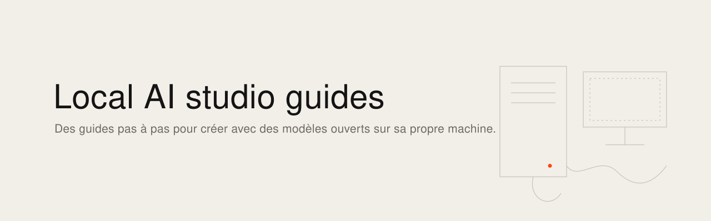
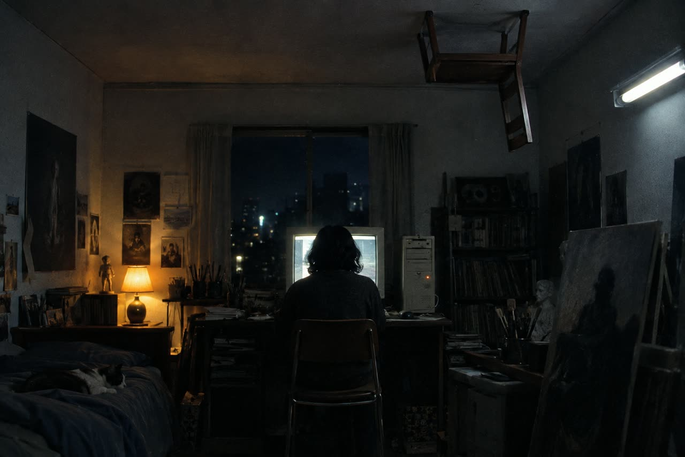

<picture><source media="(prefers-color-scheme: dark)" srcset="banner.svg"></picture>

[English](README.md) · [Français](README.fr.md)

# Guides d'atelier IA en local

Des guides pratiques, pas à pas, pour des artistes qui veulent produire des images et des vidéos avec des modèles ouverts sur leur propre machine : entraîner un LoRA sur ses photographies, premières images et premières vidéos dans ComfyUI, Pinokio comme porte d'entrée du local, ce que MiniMax H3 permet et interdit, fal.ai pour le gros calcul, et comment fabriquer une image 2D navigable en HTML et JavaScript simple. Écrits en septembre 2026 pour les artistes de la résidence Écritures Liquides (CENTQUATRE-Paris), dont je suis le mentor, et vérifiés contre la documentation et les retours d'utilisateurs du moment. Tout est fait pour être réalisé par l'artiste seul, sur une station Windows avec une carte de 32 Go ; l'essentiel vaut ailleurs.

Les guides sont dans `guides/`. Chacun se termine par les sources contre lesquelles il a été vérifié, et la date.

| # | Guide | Ce que vous obtenez |
|---|---|---|
| 00 | Organiser ses essais | Un rangement qui permet de refaire, comparer et changer de modèle sans rien perdre |
| 01 | Entraîner un LoRA | D'un dossier de photographies à un fichier `.safetensors` utilisable, avec AI Toolkit sur Qwen-Image 2.1 ou Flux |
| 02 | Premières images dans ComfyUI | Qwen-Image 2.1 et FLUX.2 sur une carte de 32 Go, graines, prompts, comparaisons |
| 03 | Premières vidéos dans ComfyUI | Wan 2.2 et LTX-2.3 en local, durées et mémoire réalistes |
| 04 | Pinokio, le local | Pinokio comme porte d'entrée du local, partage par code, ce qu'il ne faut jamais exposer |
| 05 | MiniMax H3 | Usage en ligne, poids locaux, LoRA, et la licence qui exclut l'Union européenne |
| 06 | fal.ai, le gros calcul | Unités de facturation, repères de prix septembre 2026, estimer un lot, plafonner |
| 07 | Image interactive 2D en HTML | Une grande image navigable avec zones animées et clics, sans moteur de jeu, mise en ligne gratuite |
| 08 | Chercher des archives pour un film | Méthode, familles de fonds, requêtes multilingues, registre, documenter une absence |
| 09 | Exemples de fonds par pays | Fonds vérifiés pour le Vietnam (années 1990), Madagascar (XXe siècle) et un troisième cas |

---

État vérifié au 23 septembre 2026. Chaque guide liste les sources contre lesquelles il a été vérifié.

Ismaël Joffroy Chandoutis, 2026. Textes sous licence [CC BY-SA 4.0](LICENSE).

Par [Ismaël Joffroy Chandoutis](https://ismaeljoffroychandoutis.com).
