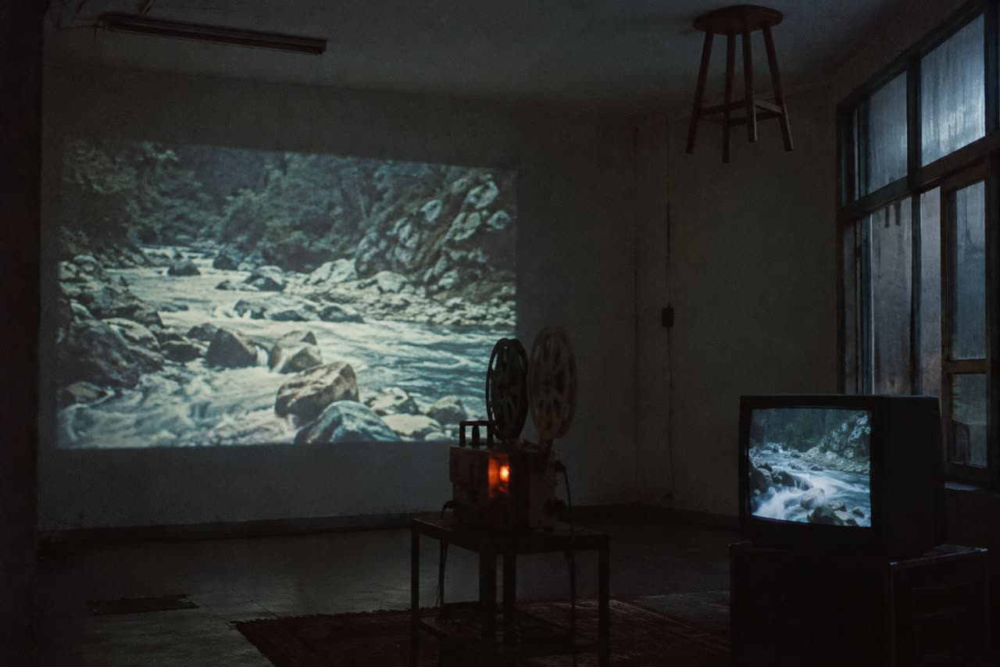

**Version : v2026-09-23.1 · 23/09/2026 00h27 Paris · sources : web, vérifié · résidence Écritures Liquides**

# Vos premières vidéos dans ComfyUI

Vous partez d'une image et vous essayez un mouvement court. Ce guide utilise deux modèles locaux : Wan 2.2 TI2V 5B et LTX-2.3. Les workflows indiqués sont ceux de ComfyUI, vérifiés en ligne le 23 septembre 2026. Leur fonctionnement et leur temps de calcul n'ont pas été mesurés sur la tour de la résidence. [Wan dans ComfyUI](https://docs.comfy.org/tutorials/video/wan/wan2_2), [LTX-2.3 dans ComfyUI](https://docs.comfy.org/tutorials/video/ltx/ltx-2-3).

## 1. Ouvrir la bonne interface et préparer une image

Selon la fiche d installation de la tour (interne), ouvrez `http://ia104:8188` depuis votre ordinateur connecté au Tailscale autorisé. Sur la tour elle-même : `http://127.0.0.1:8188`. L'installation se trouve dans `C:\AI\ComfyUI`. La règle d'atelier est de lancer un seul calcul lourd à la fois, sans entraînement LoRA en parallèle. Les fichiers de modèles doivent être sur la tour, même si vous pilotez depuis votre portable.

Un **workflow** est un ensemble de boîtes reliées, chacune effectuant une opération : charger l'image, lire le texte, calculer et enregistrer. **I2V** signifie *image vers vidéo*. Les modèles sont les fichiers de poids ; le workflow JSON est le fichier de réglages qui les relie. [Fonctionnement des workflows](https://docs.comfy.org/basic-concepts/workflow).

Conseil d'atelier : choisissez une seule image lisible, avec un sujet identifiable et un cadrage proche du plan final. Gardez l'original. Pour le premier essai, demandez un geste simple ou un mouvement de caméra lent. Votre critère de réussite peut être « le visage reste reconnaissable pendant le mouvement », plutôt que « obtenir immédiatement le plan définitif ».

Ouvrez **Templates**, dans la barre latérale, ou **Workflow → Browse Workflow Templates**. Les modèles manquants sont signalés à l'ouverture. Sur cette installation manuelle, un téléchargement lancé dans votre navigateur peut arriver sur votre portable : copiez alors les poids dans les dossiers de la tour ci-dessous. Le plus direct est de télécharger dans le navigateur de la session Windows de la tour, puis de ranger les fichiers avec son Explorateur. Charger une image avec **Load Image** est une autre opération. [Bibliothèque et téléchargement des modèles](https://docs.comfy.org/interface/features/template).

## 2. Wan 2.2 : un premier plan sans son

Cherchez **Wan2.2 5B**. Vous pouvez aussi télécharger le [workflow officiel `video_wan2_2_5B_ti2v.json`](https://raw.githubusercontent.com/Comfy-Org/workflow_templates/main/templates/video_wan2_2_5B_ti2v.json), puis le glisser dans ComfyUI. Ce modèle 5B sert à la génération depuis du texte ou une image. Le workflow choisi ne produit pas de piste sonore. [Guide officiel Wan](https://docs.comfy.org/tutorials/video/wan/wan2_2), [workflow consulté](https://raw.githubusercontent.com/Comfy-Org/workflow_templates/main/templates/video_wan2_2_5B_ti2v.json).

### Les trois fichiers

Les liens de téléchargement sont intégrés au workflow ; les poids sont aussi dans le [dépôt Comfy-Org/Wan_2.2_ComfyUI_Repackaged](https://huggingface.co/Comfy-Org/Wan_2.2_ComfyUI_Repackaged). Respectez les noms : le VAE est le composant qui transforme les données calculées en images visibles. [Fichiers officiels Wan](https://docs.comfy.org/tutorials/video/wan/wan2_2).

| Fichier | Dossier sur la tour |
|---|---|
| `wan2.2_ti2v_5B_fp16.safetensors` | `C:\AI\ComfyUI\models\diffusion_models\` |
| `umt5_xxl_fp8_e4m3fn_scaled.safetensors` | `C:\AI\ComfyUI\models\text_encoders\` |
| `wan2.2_vae.safetensors` | `C:\AI\ComfyUI\models\vae\` |

Sélectionnez ces noms dans **Load Diffusion Model**, **Load CLIP** et **Load VAE**. Le nœud **Load Image** arrive désactivé : sélectionnez-le et utilisez **Ctrl+B** pour l'activer, puis choisissez votre image. Sans cette activation, vous lancez une vidéo à partir du texte seul. [Procédure officielle](https://docs.comfy.org/tutorials/video/wan/wan2_2).

### Les réglages de départ

Ces valeurs sont celles du JSON consulté. Les **steps** sont les étapes de calcul ; **CFG** règle l'intensité du guidage par le texte ; la **seed**, ou graine, initialise l'aléatoire. [KSampler](https://docs.comfy.org/built-in-nodes/sampling/ksampler).

| Où | Valeur de référence |
|---|---|
| `Wan22ImageToVideoLatent` | largeur `1280`, hauteur `704`, `length = 121`, `batch_size = 1` |
| `KSampler` | `steps = 20`, `cfg = 5`, `sampler_name = uni_pc`, `scheduler = simple`, `denoise = 1` |
| `ModelSamplingSD3` | `shift = 8`, conserver cette valeur |
| `CreateVideo` | `fps = 24` |

Source : [JSON Wan officiel](https://raw.githubusercontent.com/Comfy-Org/workflow_templates/main/templates/video_wan2_2_5B_ti2v.json). Ici, `length` compte les images, pas les secondes : `121 ÷ 24` donne environ cinq secondes. Le format dit 720p de cette variante est bien `1280 × 704`. [Dépôt Wan](https://github.com/Wan-Video/Wan2.2).

Conseil d'atelier : pour un premier contrôle plus court, essayez `length = 49`, soit environ deux secondes à 24 images/seconde ; revenez ensuite à `121`. Gardez les autres valeurs. Cette variante courte est un choix d'atelier à qualifier, pas un résultat mesuré ici.

Écrivez votre texte dans **Positive Prompt**. Exemple d'atelier à adapter à votre image :

> A person stands beside an open window. They slowly turn their head toward the light and stop. A light breeze moves the curtain. The camera remains still. Soft daylight, continuous shot.

Pour ce premier essai, conservez le texte négatif du modèle de workflow. Cliquez une fois sur **Run**, puis attendez la sortie.

## 3. LTX-2.3 : une image animée avec du son

Cherchez **LTX-2.3 I2V**, ou téléchargez le [JSON officiel `video_ltx2_3_i2v.json`](https://raw.githubusercontent.com/Comfy-Org/workflow_templates/main/templates/video_ltx2_3_i2v.json). Utilisez précisément la version **2.3** : certaines pages générales LTX décrivent désormais la 2.5, dont les fichiers diffèrent. Les composants 2.3 ne sont pas interchangeables avec les 2.5. [Compatibilité indiquée par Lightricks](https://github.com/Lightricks/LTX-2#legacy-ltx-23).

Le modèle peut générer ensemble image animée et son. La fiche LTX-2.3 indique l'anglais comme langue du modèle ; commencez avec un texte anglais simple, sans supposer une qualité équivalente dans toutes les langues. [Fiche LTX-2.3](https://huggingface.co/Lightricks/LTX-2.3).

### Les cinq fichiers du workflow actuel

Téléchargez les fichiers depuis les liens de la [page ComfyUI LTX-2.3](https://docs.comfy.org/tutorials/video/ltx/ltx-2-3). Le checkpoint FP8 se trouve dans le [dépôt séparé Lightricks/LTX-2.3-fp8](https://huggingface.co/Lightricks/LTX-2.3-fp8/blob/main/ltx-2.3-22b-dev-fp8.safetensors). Ici, **FP8** et **FP4** désignent des formats numériques compacts. Un **LoRA** est un petit complément au modèle : ceux-ci font partie de la recette publiée, ce ne sont pas vos LoRA artistiques. Un **upscaler** agrandit l'image pendant le calcul.

| Fichier exact | Sous-dossier de `C:\AI\ComfyUI\models\` |
|---|---|
| `ltx-2.3-22b-dev-fp8.safetensors` | `checkpoints\` |
| `ltx_2.3_22b_distilled_1.1_lora_dynamic_fro09_avg_rank_111_bf16.safetensors` | `loras\` |
| `gemma-3-12b-it-abliterated_lora_rank64_bf16.safetensors` | `loras\` |
| `gemma_3_12B_it_fp4_mixed.safetensors` | `text_encoders\` |
| `ltx-2.3-spatial-upscaler-x2-1.1.safetensors` | `latent_upscale_models\` |

Source : [liste officielle pour I2V](https://docs.comfy.org/tutorials/video/ltx/ltx-2-3). Ne remplacez pas le checkpoint `dev-fp8` par un `distilled-fp8` en conservant arbitrairement le reste : la fiche présente aussi des workflows différents, dont celui avec première et dernière image.

### Régler le plan

Dans **Load Image**, chargez votre image. La grande boîte **Image to Video (LTX-2.3)** regroupe les opérations. Le JSON consulté affiche `1280 × 720`, `duration = 5`, `fps = 25`, et `prompt_enhance = false`. Le calcul interne utilise Euler, CFG `1`, une première passe de huit étapes puis une seconde de trois étapes après agrandissement. Conservez ces réglages internes. [JSON LTX-2.3 vérifié](https://raw.githubusercontent.com/Comfy-Org/workflow_templates/main/templates/video_ltx2_3_i2v.json).

Conseil d'atelier pour qualifier la tour : entrez **`width = 768`, `height = 512`, `duration = 4`, `fps = 24`**. Ce choix donne environ quatre secondes. Il réduit la taille du premier essai ; ce n'est pas un benchmark. Après réussite, essayez `1280 × 704` avec la même durée.

La fiche du modèle demande des dimensions divisibles par 32 et un nombre d'images de la forme `8 × n + 1`, par exemple 97. Le workflow 2.3 calcule `duration × fps + 1` et commence à demi-résolution avant d'agrandir. Les deux tailles proposées gardent également des demi-dimensions divisibles par 32 ; `4 × 24 + 1 = 97`. Ne confondez pas le champ `duration` de cette grande boîte avec un champ `length` exprimé en images. [Contraintes du modèle](https://huggingface.co/Lightricks/LTX-2.3#general-tips), [calculs du workflow](https://raw.githubusercontent.com/Comfy-Org/workflow_templates/main/templates/video_ltx2_3_i2v.json).

Gardez `prompt_enhance = false` pour le premier essai. Exemple d'atelier, en un paragraphe :

> A person stands beside an open window in soft morning light. They slowly turn their head toward the window, then remain still. A breeze gently lifts the curtain. The camera stays fixed throughout the shot. We hear distant street sounds and the soft rustle of fabric. There is no dialogue and no music.

Le guide LTX recommande de décrire l'action dans le temps, le cadrage, le mouvement de caméra et les sons. Pour partir d'une image, un plan continu est un bon premier exercice. Ces conseils de rédaction restent distincts des nouvelles fonctionnalités 2.5 également décrites sur cette page. [Guide de prompt LTX](https://docs.ltx.io/open-source-model/usage-guides/prompting-guide).

Cliquez sur **Run**. Examinez l'image et écoutez la vidéo : la fiche LTX-2.3 prévient notamment que le son sans parole peut être de qualité inférieure. [Limites officielles](https://huggingface.co/Lightricks/LTX-2.3#limitations).

## 4. Combien de temps et quelle mémoire ?

**Il n'existe pas ici de temps vérifié pour notre tour.** Les durées ci-dessous sont des points de comparaison publiés, avec leur contexte.

| Cas | Ce qui est effectivement documenté |
|---|---|
| Wan TI2V 5B, cinq secondes en 720p | L'équipe annonce moins de neuf minutes sur un GPU grand public, sans optimisation particulière. Sa commande de référence utilise au moins 24 Go de VRAM avec transfert de parties du modèle en RAM. Ce chiffre ne mesure pas notre workflow Windows. [Dépôt Wan](https://github.com/Wan-Video/Wan2.2). |
| LTX-2.3 sur RTX 5090 | Un utilisateur rapporte le 30 mai 2026 un passage d'environ 34 secondes à 60 ou 70 secondes après un changement de comportement ; ses journaux montrent notamment 71,57 secondes. Il emploie SageAttention, absent du socle retenu ici. Son texte est ambigu sur le nombre d'images : ces chiffres ne constituent pas une promesse pour notre essai. [Signalement original](https://github.com/Lightricks/LTX-2/issues/224). |

Conseil d'atelier : réservez quinze minutes pour découvrir le premier calcul, sans considérer ce créneau comme une estimation du moteur. Notez séparément l'attente dans la file, le premier chargement et le temps total d'une deuxième génération à taille identique avec une autre graine. N'envoyez pas une série de dix essais avant d'avoir terminé le premier.

La **VRAM** est la mémoire de la carte graphique ; la **RAM** est la mémoire générale du PC. Le **déchargement en RAM**, souvent nommé *offload*, déplace des composants hors de la carte. ComfyUI annonce que son workflow Wan 5B peut fonctionner jusque sur 8 Go grâce à ce mécanisme : cela ne signifie pas que tous les composants tiennent simultanément sur le GPU. [Mémoire Wan dans ComfyUI](https://docs.comfy.org/tutorials/video/wan/wan2_2).

Pour LTX-2.3, le checkpoint complet en BF16, un format numérique sur 16 bits, pèse **46,1 Go** sur disque ; les 22 milliards de paramètres en 16 bits dépassent à eux seuls les 32 Go de la carte. Il ne tient donc pas entièrement en VRAM sous cette forme. Le `dev-fp8` retenu pèse **29,1 Go**, mais cette taille de fichier n'est pas la mémoire totale du calcul : encodeur, compléments et données intermédiaires s'ajoutent. Les 32 Go ne garantissent pas une longue vidéo haute définition. [Checkpoint BF16](https://huggingface.co/Lightricks/LTX-2.3/blob/main/ltx-2.3-22b-dev.safetensors), [checkpoint FP8](https://huggingface.co/Lightricks/LTX-2.3-fp8/blob/main/ltx-2.3-22b-dev-fp8.safetensors).

Wan 14B est une autre recette : le dépôt officiel exige au moins 80 Go pour ses commandes 14B de référence. Des variantes ComfyUI utilisent quantification et transferts en RAM, mais on ne peut pas déduire que le workflow 14B complet tient sur 32 Go en reprenant les chiffres du 5B. Pour débuter, restez au 5B. [Exigences Wan](https://github.com/Wan-Video/Wan2.2), [variantes ComfyUI](https://docs.comfy.org/tutorials/video/wan/wan2_2).

## 5. Ce qui coince

| Ce que vous voyez | Ce que vous pouvez faire |
|---|---|
| Modèle absent d'une liste | Vérifiez le nom et le dossier sur la tour, puis appuyez sur `R` hors d’un champ texte pour actualiser les listes. [Actualisation documentée](https://docs.comfy.org/get_started/first_generation). La fenêtre « modèle manquant » peut aussi ne pas reconnaître un fichier rangé dans un sous-dossier : sélectionnez alors ce fichier explicitement dans le chargeur. [Documentation des modèles de workflows](https://docs.comfy.org/interface/features/template). |
| Des boîtes rouges ou des nœuds manquants | Un workflow récent peut demander des nœuds absents de la version installée, ou un nœud peut avoir échoué au démarrage. Comparez avec le JSON officiel et les journaux `C:\AI\logs\comfy.stderr.log` indiqués dans la fiche locale. N'ajoutez pas un paquet de nœuds tiers au hasard : les workflows présentés sont natifs. [Diagnostic officiel LTX](https://docs.comfy.org/tutorials/video/ltx/ltx-2-3). |
| Wan ignore mon image | Vérifiez que **Load Image** est activé, avec **Ctrl+B**, et qu'une image est chargée. [Procédure Wan](https://docs.comfy.org/tutorials/video/wan/wan2_2). |
| Modifier le négatif LTX ne change rien | Le signalement du 3 juin 2026 relève qu'avec **CFG = 1**, le guidage standard ignore le négatif. Le JSON consulté utilise toujours CFG `1`. Travaillez le prompt positif ; ne montez pas le CFG arbitrairement pour activer ce champ. [Signalement détaillé](https://github.com/Comfy-Org/workflow_templates/issues/919). |
| `CUDA out of memory` ou `OOM` | La mémoire manque. Conseil d'atelier : revenez au petit essai, une vidéo à la fois, et vérifiez qu'aucun entraînement n'occupe la tour. Pour LTX, un utilisateur a signalé le 30 juin 2026 un échec sur 5090 malgré 200 Go de RAM ; ses traces impliquent aussi des nœuds tiers `10S`. Cela ne prouve pas un échec systématique du workflow natif. [Rapport et traces](https://github.com/Comfy-Org/ComfyUI/issues/14683). |
| Le résultat change après une mise à jour | Reprenez d'abord le JSON et les versions conservés. Le retour RTX 5090 du 30 mai documente une variation importante de vitesse entre deux états logiciels. Une mise à jour n'est pas une mesure de performance. [Signalement](https://github.com/Lightricks/LTX-2/issues/224). |

Conseil d'atelier : si l'erreur persiste sur le petit workflow officiel, gardez le message complet, le nom de la boîte en erreur et le JSON. Ne réinstallez pas les pilotes pour une déformation de visage : c'est d'abord un problème de résultat à comparer avec une autre image, un mouvement plus simple ou une autre graine.

## 6. Garder le plan et comparer deux essais

Pour Wan, choisissez un nombre dans `seed`, puis remplacez `randomize` par `fixed`. Pour LTX, conservez la valeur du champ `seed` ; si vous ouvrez le groupe et changez d'autres graines, notez-les aussi. Une graine fixe sert à contrôler l'aléatoire ; les autres paramètres restent déterminants. [KSampler](https://docs.comfy.org/built-in-nodes/sampling/ksampler), [workflow LTX](https://raw.githubusercontent.com/Comfy-Org/workflow_templates/main/templates/video_ltx2_3_i2v.json).

Dans **Save Video**, donnez au champ `filename_prefix` un nom comme `video/lea-fenetre-001`, puis gardez le format `auto`. La sortie est enregistrée sur la tour dans `C:\AI\ComfyUI\output\video\`, avec un compteur ajouté au nom. [Fonctionnement de Save Video](https://raw.githubusercontent.com/Comfy-Org/ComfyUI/master/comfy_extras/nodes_video.py).

Copiez la vidéo depuis ce dossier dans votre dossier d’essai. Si votre navigateur propose **Enregistrer la vidéo sous…** dans le menu contextuel de la prévisualisation, vous pouvez aussi récupérer le MP4 de cette manière.

Exportez le workflow avec **Workflows → Export**, puis nommez le JSON comme l’essai. Pour le rouvrir : **Workflows → Open**. [Export et ouverture documentés](https://docs.comfy.org/get_started/first_generation). ComfyUI peut intégrer le workflow à certains fichiers de sortie, mais le JSON indépendant reste le document facile à conserver et à partager. [Sauvegarde des workflows](https://docs.comfy.org/basic-concepts/workflow#saving-and-sharing-workflows).

Conseil d'atelier : gardez ensemble `image-source.png`, `essai-001.json`, la vidéo et une note. Pour `essai-002`, changez seulement « caméra fixe » en « lent mouvement latéral », en conservant image, graine, taille et durée. Regardez les deux vidéos jusqu'au bout : début, milieu et dernière image. Notez le mouvement, les déformations, le respect du cadrage et, pour LTX, le son. Conservez aussi un échec instructif.

Les métadonnées peuvent disparaître après un réencodage vidéo. Le JSON ne contient ni les poids ni votre image source : conservez-les séparément. [Métadonnées des workflows](https://docs.comfy.org/development/api-development/workflow-metadata).

Le guide [Organiser ses essais](GUIDE-ORGANISER-SES-ESSAIS.md) donne la convention commune de rangement. La liste des sources consultées, leurs dates et les limites de vérification figurent dans [SOURCES.md](SOURCES.md).
