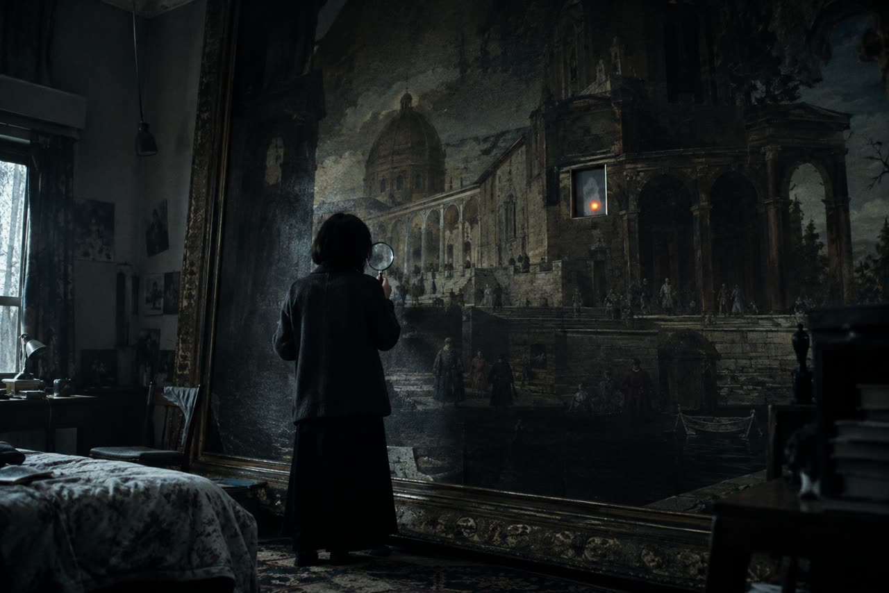

**Version : v2026-09-23.1 · 23/09/2026 00h39 Paris · sources : web, vérifié · résidence Écritures Liquides**

# Un grand tableau à parcourir dans un navigateur



Vous pouvez commencer avec une image, quelques zones animées et des boutons. HTML place les éléments, CSS règle leur apparence et leur position, JavaScript réagit aux gestes. Une transformation appliquée à un même conteneur fait bouger et grandir ensemble le fond et les éléments posés dessus. [Transformations CSS](https://developer.mozilla.org/en-US/docs/Web/CSS/Reference/Properties/transform), [vidéo HTML](https://developer.mozilla.org/en-US/docs/Web/HTML/Reference/Elements/video).

**Commencez par une seule image et une seule interaction.** Le fichier [EXEMPLE-TABLEAU-2D.html](EXEMPLE-TABLEAU-2D.html) fourni à côté fonctionne sans installation : ouvrez-le dans votre navigateur. Il contient un dessin de remplacement, un déplacement à la souris ou au doigt, un zoom, une lumière cliquable et un emplacement pour votre vidéo. C'est une maquette à remplacer par votre œuvre.

## Choisir comment explorer l'image

| Votre besoin | Point de départ | Ce que cela implique |
| --- | --- | --- |
| Une image qui se charge convenablement sur le téléphone du public | Une image unique, `transform: translate(...) scale(...)` | Tout le fichier est chargé ; le code fourni gère le déplacement et le zoom. [CSS transform](https://developer.mozilla.org/en-US/docs/Web/CSS/Reference/Properties/transform) |
| Un très grand tableau, avec des détails à plusieurs niveaux de grossissement | **OpenSeadragon**, avec des tuiles | Préparer de petites images pour chaque niveau de zoom. Le navigateur demande les morceaux nécessaires. [Format DZI](https://openseadragon.github.io/examples/tilesource-dzi/) |
| Un plan ou une carte imaginaire, avec repères et zones | **Leaflet**, en mode `L.CRS.Simple` | Ce mode utilise des coordonnées planes. Une image unique peut suffire ; le découpage en tuiles est une étape supplémentaire. Attention : les coordonnées Leaflet sont dans l'ordre vertical, horizontal. [Exemple officiel](https://leafletjs.com/examples/crs-simple/crs-simple.html) |

Il n'existe pas de seuil universel « au-delà de tant de pixels, cela ne marche plus ». Faites votre choix en testant le chargement et le déplacement sur le téléphone qui servira à regarder l'œuvre. Gardez une version légère pour ces essais.

## Poser une vidéo sur un détail

Placez le fond, la vidéo et les boutons **dans le même conteneur**. La vidéo utilise une position absolue : `left` et `top` indiquent son emplacement ; `width` et `height`, son étendue. Dans l'exemple, ces nombres sont des pourcentages du tableau, pas de l'écran. Elle reste ainsi attachée au même détail pendant le zoom. [Positionnement CSS](https://developer.mozilla.org/en-US/docs/Web/CSS/position), [transformations](https://developer.mozilla.org/en-US/docs/Web/CSS/Reference/Properties/transform).

```html
<video src="boucle.mp4" autoplay muted loop playsinline
       style="position:absolute;left:45%;top:35%;width:25%;height:30%;object-fit:cover">
</video>
```

`loop` recommence la vidéo, `muted` coupe le son et `playsinline` demande une lecture dans la page sur mobile. `autoplay` demande un démarrage automatique, sans le garantir : prévoyez un bouton Lecture. Si vous voulez du son, faites-le démarrer après un geste explicite du public. [Attributs vidéo](https://developer.mozilla.org/en-US/docs/Web/HTML/Reference/Elements/video), [conditions de lecture](https://developer.mozilla.org/en-US/docs/Web/API/HTMLMediaElement/play).

Une vidéo opaque recouvre le fond avec un rectangle. Préparez donc une boucle cadrée comme la portion de tableau correspondante ; le MP4 H.264 courant ne vous apporte pas automatiquement un fond transparent. Un GIF animé peut se poser comme une image, mais son nombre de couleurs est limité ; testez aussi WebP animé ou une vidéo pour les boucles complexes. [Formats d'image, dont GIF](https://developer.mozilla.org/en-US/docs/Web/Media/Guides/Formats/Image_types), [formats vidéo](https://developer.mozilla.org/en-US/docs/Web/Media/Guides/Formats/Video_codecs), [WebP](https://developers.google.com/speed/webp).

## Un squelette à modifier

Ouvrez le fichier d'exemple dans un éditeur de texte. Son code complet est reproduit en fin de guide. Vous n'avez besoin ni de framework, c'est-à-dire d'un ensemble logiciel imposant sa structure, ni d'une compilation.

Pour mettre votre image, copiez `tableau.webp` à côté du fichier HTML et remplacez tout le bloc `<svg>...</svg>` par :

```html

```

Adaptez les dimensions de `#monde` dans le CSS et les constantes `W` et `H` dans le JavaScript aux dimensions de votre image. Par exemple, pour 6000 × 3600 pixels, mettez `width:6000px;height:3600px` et `const W = 6000, H = 3600`. Les positions en pourcentage des zones restent proportionnelles au tableau. [Images HTML](https://developer.mozilla.org/en-US/docs/Web/HTML/Element/img), [coordonnées et transformations CSS](https://developer.mozilla.org/en-US/docs/Web/CSS/Reference/Properties/transform).

Le bouton **Votre vidéo** sert à essayer un fichier local. Il ne l'envoie à aucun serveur et ne le conserve pas après fermeture de la page. Pour publier votre boucle, copiez `boucle.mp4` à côté de l'HTML, ajoutez `src="boucle.mp4"` à la balise vidéo et retirez `hidden`. Le bouton Lecture reste utilisable ; ajoutez `autoplay` si vous voulez demander un démarrage automatique. [Adresses temporaires de fichiers](https://developer.mozilla.org/en-US/docs/Web/API/URL/createObjectURL_static), [vidéo HTML](https://developer.mozilla.org/en-US/docs/Web/HTML/Reference/Elements/video).

Pour ajouter une interaction, dupliquez le bouton de la lampe, donnez-lui un autre `id`, déplacez-le en CSS et ajoutez une fonction de clic. Le squelette change une classe CSS et le texte du bouton. Vous pouvez, de la même manière, révéler un texte ou changer l'image. Gardez un vrai `<button>` pour que le clic soit également utilisable au clavier. [Événements de clic](https://developer.mozilla.org/en-US/docs/Web/API/Element/click_event), [bouton HTML](https://developer.mozilla.org/en-US/docs/Web/HTML/Element/button).

La maquette gère un doigt à la fois et les boutons +/− ; elle ne code pas le pincement à deux doigts. Sur ordinateur, vous disposez aussi de la molette et des flèches après un clic dans le tableau. Pour une navigation tactile plus complète dans une très grande image, passez à OpenSeadragon. [Pointer Events](https://developer.mozilla.org/en-US/docs/Web/API/Pointer_events), [exemples OpenSeadragon](https://openseadragon.github.io/examples/tilesource-dzi/).

## Quand passer aux tuiles

Une **pyramide de tuiles** contient plusieurs versions du tableau, du petit aperçu aux détails. Avec libvips installé et sa commande `vips` accessible, cette commande produit `tableau.dzi` et un dossier `tableau_files` :

```powershell
vips dzsave tableau.png tableau --tile-size 256 --suffix ".jpg[Q=85]"
```

Gardez les deux ensemble. Dans OpenSeadragon, le paramètre `tileSources: "tableau.dzi"` indique le fichier à ouvrir. Ce n'est pas un simple remplacement de la balise `` : intégrez la bibliothèque en suivant son exemple DZI. Les vidéos et boutons doivent devenir des éléments superposés gérés par le visualiseur, appelés **overlays**, pour rester alignés au zoom. [Création de pyramides libvips](https://www.libvips.org/API/current/making-image-pyramids.html), [chargement DZI](https://openseadragon.github.io/examples/tilesource-dzi/), [overlays OpenSeadragon](https://openseadragon.github.io/examples/ui-overlays/).

## Réduire le poids sans perdre les détails utiles

Gardez les originaux séparément et exportez des copies pour le Web. Pour l'image fixe, comparez WebP et JPEG à l'écran au zoom réellement proposé. WebP offre des modes avec ou sans perte et la transparence. Avec l'outil `cwebp` installé, voici un point de départ, à juger visuellement : `cwebp -q 80 tableau.png -o tableau.webp`. La qualité 80 est une proposition de travail, pas une norme. [WebP](https://developers.google.com/speed/webp), [commande cwebp](https://developers.google.com/speed/webp/docs/cwebp).

Pour une boucle vidéo, **H.264 dans un MP4** offre une large compatibilité. **AV1** peut mieux compresser, mais sa prise en charge et son décodage varient selon le navigateur et le matériel : proposez un MP4 H.264 de secours si votre public est varié. Les noms MP4 et WebM désignent des conteneurs, les boîtes qui transportent la vidéo ; H.264 et AV1 désignent la méthode de compression, appelée codec. [Comparaison des codecs et compatibilité](https://developer.mozilla.org/en-US/docs/Web/Media/Guides/Formats/Video_codecs).

Avec FFmpeg installé et l'encodeur `libx264` disponible, cette commande fabrique une boucle sans son de 960 pixels de large. Adaptez la largeur à la taille de votre zone au zoom maximal :

```powershell
ffmpeg -i source.mp4 -an -vf "scale=960:-2" -c:v libx264 -crf 23 -preset medium -pix_fmt yuv420p -movflags +faststart boucle.mp4
```

`-an` retire le son, `crf` règle le compromis qualité/poids, et `faststart` place les informations du MP4 au début pour permettre sa lecture avant la fin du téléchargement. Le nombre 23 est un point de départ. Si votre source fait moins de 960 pixels de large, choisissez une largeur inférieure pour éviter un agrandissement inutile. [Options FFmpeg](https://ffmpeg.org/ffmpeg.html), [filtre scale](https://ffmpeg.org/ffmpeg-filters.html#scale), [encodeur H.264](https://ffmpeg.org/ffmpeg-codecs.html#libx264_002c-libx264rgb), [option faststart](https://ffmpeg.org/ffmpeg-formats.html#mov_002c-mp4_002c-ismv).

Comme objectif de maquette, essayez un premier écran sous **10 Mo** et une seule boucle en lecture. C'est un budget proposé, pas une limite des navigateurs. Par calcul, une boucle de 10 secondes encodée à 2 mégabits par seconde représente environ `10 × 2 ÷ 8 = 2,5 Mo`, hors son et conteneur. Quatre boucles de ce poids représentent déjà 10 Mo. Mesurez vos exports réels ; les tuiles réduisent le téléchargement initial sans supprimer le poids total de l'œuvre.

## Mettre en ligne gratuitement

Un site HTML/CSS/JavaScript sans calcul serveur est un **site statique**. Les offres gratuites ci-dessous conviennent à un prototype sous leurs conditions et limites ; elles ne garantissent pas un hébergement illimité de vos vidéos.

| Service | Procédure courte | Limite à connaître au 23 septembre 2026 |
| --- | --- | --- |
| **GitHub Pages** | Créez un dépôt public, ajoutez `index.html` et vos médias, puis ouvrez **Settings > Pages**, choisissez le déploiement depuis une branche, `main`, dossier racine, et enregistrez. | Gratuit avec un dépôt public. Site publié limité à 1 Go et limite souple de transfert de 100 Go/mois. [Création](https://docs.github.com/en/pages/getting-started-with-github-pages/creating-a-github-pages-site), [limites](https://docs.github.com/en/pages/getting-started-with-github-pages/github-pages-limits) |
| **Vercel** | Importez un dépôt Git contenant votre site statique. | L'offre **Hobby** est réservée à l'usage personnel non commercial. Vérifiez l'adéquation au porteur réel du site avant de retenir cette offre pour la résidence. [Déploiement](https://vercel.com/docs/deployments), [conditions Hobby](https://vercel.com/docs/plans/hobby) |
| **Netlify** | Connectez un dépôt ou déposez le dossier du site avec le déploiement manuel. | L'offre **Free** affiche 300 crédits mensuels, à répartir entre les usages facturés. Ce n'est pas un quota illimité de vidéo. [Déploiement manuel](https://docs.netlify.com/deploy/create-deploys/), [tarifs actuels](https://www.netlify.com/pricing/) |

Renommez une copie de l'exemple en `index.html`. Publiez seulement le dossier de votre œuvre, contenant l'HTML et les médias nécessaires. Gardez des chemins relatifs comme `boucle.mp4`, particulièrement pour GitHub Pages où le site peut vivre sous le nom du dépôt. Testez ensuite l'adresse publique sur téléphone : ouverture, zoom, bouton, vidéo, retour à la vue complète. [Fichier d'entrée et publication Pages](https://docs.github.com/en/pages/getting-started-with-github-pages/creating-a-github-pages-site), [résolution des URL relatives](https://developer.mozilla.org/en-US/docs/Web/API/URL_API/Resolving_relative_references).

## À regarder, puis décider si la 3D est nécessaire

[Zoomquilt](https://zoomquilt.org/) montre une peinture collective explorée par un zoom continu. Regardez les raccords et le rythme : ce n'est pas un modèle de promenade libre dans toutes les directions. Le [Rijksmuseum, image à très haute résolution de La Ronde de nuit](https://www.rijksmuseum.nl/en/stories/operation-night-watch/story/ultra-high-resolution-photo), montre l'intérêt de garder de vrais détails quand on s'approche. Les [exemples d'overlays OpenSeadragon](https://openseadragon.github.io/examples/ui-overlays/) donnent une référence technique pour les zones qui restent attachées à l'image.

Passez à **Three.js** si votre intention demande de la profondeur : objets devant et derrière, perspective, caméra qui change de point de vue. Cette bibliothèque organise une scène, une caméra et un rendu 3D. Pour un tableau plat avec des détails animés, gardez d'abord la structure ci-dessus et terminez un petit parcours. [Fondamentaux Three.js](https://threejs.org/manual/pages/fundamentals.html).

## Code complet de la maquette

Ce code original utilise les API documentées dans les liens du guide. Il ne charge aucune bibliothèque externe. Le dessin intégré permet de tester la navigation immédiatement ; ajoutez votre propre vidéo pour tester la lecture.

```html
<meta charset="utf-8">
<!-- Version : v2026-09-23.1 · 23/09/2026 00h39 Paris · sources : web, vérifié · résidence Écritures Liquides -->
<html lang="fr">
<title>Un tableau à parcourir</title>
<meta name="viewport" content="width=device-width, initial-scale=1">
<style>
  * { box-sizing: border-box; }
  body { margin: 0; font: 16px system-ui; color: #eee; background: #202222; }
  header { padding: 12px; display: flex; gap: 10px; flex-wrap: wrap; align-items: center; }
  button, input { font: inherit; }
  button { padding: 8px 14px; cursor: pointer; }
  #vue { height: 72vh; overflow: hidden; position: relative; touch-action: none; cursor: grab; }
  #monde { width: 2000px; height: 1200px; position: absolute; transform-origin: 0 0; }
  #fond { width: 100%; height: 100%; display: block; user-select: none; }
  #boucle { position: absolute; left: 45%; top: 35%; width: 25%; height: 30%; object-fit: cover; }
  #lampe { position: absolute; left: 20%; top: 25%; font-size: 36px; }
  #monde.allume #lampe { background: #ffe777; }
  #monde.allume #fond { filter: brightness(1.25); }
  #etat { padding: 0 12px; }
  :focus-visible { outline: 3px solid #ffca70; outline-offset: 2px; }
</style>
<header>
  <strong>Un tableau à parcourir</strong>
  <button id="moins" aria-label="Dézoomer">−</button>
  <button id="plus" aria-label="Zoomer">+</button>
  <button id="recentrer">Tout voir</button>
  <label>Votre vidéo : <input id="fichier" type="file" accept="video/*"></label>
  <button id="lecture">Lecture / pause</button>
</header>
<main id="vue" tabindex="0" aria-label="Tableau : glisser, molette, ou flèches du clavier">
  <div id="monde">
    <!-- Remplacez ce dessin par . -->
    <svg id="fond" viewBox="0 0 2000 1200" role="img" aria-label="Maquette : un terrain ocre, une maison et un bassin">
      <rect width="2000" height="1200" fill="#b68c60"/>
      <path d="M0 1050 Q900 600 2000 850" fill="none" stroke="#e8d5ab" stroke-width="130"/>
      <rect x="300" y="200" width="430" height="390" fill="#70584c"/>
      <rect x="900" y="420" width="500" height="360" fill="#497b80"/>
      <circle cx="1670" cy="290" r="150" fill="#576348"/>
      <text x="970" y="620" fill="white" font-size="36">Votre boucle vidéo ici</text>
    </svg>
    <!-- Pour publier : ajoutez src="boucle.mp4" et retirez hidden. -->
    <video id="boucle" muted loop playsinline preload="metadata" hidden></video>
    <button id="lampe" aria-pressed="false">Allumer</button>
  </div>
</main>
<p id="etat" role="status">Glissez pour explorer. Molette ou +/− pour zoomer. Cliquez sur Allumer.</p>
<script>
  const vue = document.querySelector('#vue'), monde = document.querySelector('#monde');
  const video = document.querySelector('#boucle'), etat = document.querySelector('#etat');
  // Dimensions du tableau : adaptez W, H et la taille CSS de #monde ensemble.
  const W = 2000, H = 1200;
  let x = 0, y = 0, zoom = 1, minimum = 1, geste = null, urlVideo;
  function dessiner() {
    // Les limites empêchent de perdre le tableau hors de la fenêtre.
    x = W * zoom < vue.clientWidth ? (vue.clientWidth - W * zoom) / 2
      : Math.min(0, Math.max(vue.clientWidth - W * zoom, x));
    y = H * zoom < vue.clientHeight ? (vue.clientHeight - H * zoom) / 2
      : Math.min(0, Math.max(vue.clientHeight - H * zoom, y));
    monde.style.transform = `translate(${x}px, ${y}px) scale(${zoom})`;
  }
  function toutVoir() {
    minimum = Math.min(vue.clientWidth / W, vue.clientHeight / H);
    zoom = minimum; x = 0; y = 0; dessiner();
  }
  function zoomer(facteur, px = vue.clientWidth / 2, py = vue.clientHeight / 2) {
    const suivant = Math.max(minimum, Math.min(minimum * 8, zoom * facteur));
    x = px - (px - x) * suivant / zoom;
    y = py - (py - y) * suivant / zoom;
    zoom = suivant; dessiner();
  }
  vue.addEventListener('wheel', e => {
    e.preventDefault();
    const r = vue.getBoundingClientRect();
    zoomer(Math.exp(-e.deltaY * 0.001), e.clientX - r.left, e.clientY - r.top);
  }, { passive: false });
  vue.addEventListener('pointerdown', e => {
    if (!e.isPrimary || e.button !== 0 || e.target.closest('button')) return;
    e.preventDefault(); vue.focus(); vue.setPointerCapture(e.pointerId);
    geste = { id: e.pointerId, x: e.clientX, y: e.clientY };
  });
  vue.addEventListener('pointermove', e => {
    if (!geste || geste.id !== e.pointerId) return;
    x += e.clientX - geste.x; y += e.clientY - geste.y;
    geste.x = e.clientX; geste.y = e.clientY; dessiner();
  });
  ['pointerup', 'pointercancel', 'lostpointercapture'].forEach(nom =>
    vue.addEventListener(nom, () => { geste = null; }));
  vue.addEventListener('keydown', e => {
    if (e.target !== vue) return;
    const pas = { ArrowLeft: [50, 0], ArrowRight: [-50, 0], ArrowUp: [0, 50], ArrowDown: [0, -50] }[e.key];
    if (pas) { e.preventDefault(); x += pas[0]; y += pas[1]; dessiner(); }
  });
  document.querySelector('#plus').onclick = () => zoomer(1.3);
  document.querySelector('#moins').onclick = () => zoomer(1 / 1.3);
  document.querySelector('#recentrer').onclick = toutVoir;
  document.querySelector('#lampe').onclick = e => {
    const allume = monde.classList.toggle('allume');
    e.currentTarget.setAttribute('aria-pressed', String(allume));
    e.currentTarget.textContent = allume ? 'Éteindre' : 'Allumer';
    etat.textContent = allume ? 'La lumière est allumée.' : 'La lumière est éteinte.';
  };
  function lire() {
    video.play().catch(() => { etat.textContent = 'Lecture impossible : essayez un MP4 H.264 et le bouton Lecture.'; });
  }
  document.querySelector('#fichier').onchange = e => {
    const fichier = e.target.files[0]; if (!fichier) return;
    if (urlVideo) URL.revokeObjectURL(urlVideo);
    urlVideo = URL.createObjectURL(fichier); // Le fichier reste sur votre ordinateur.
    video.src = urlVideo; video.hidden = false; lire();
  };
  document.querySelector('#lecture').onclick = () => {
    if (!video.getAttribute('src')) { etat.textContent = 'Choisissez une vidéo avec le bouton Votre vidéo.'; return; }
    if (video.paused) lire(); else video.pause();
  };
  window.addEventListener('resize', toutVoir);
  toutVoir();
</script>
</html>
```
